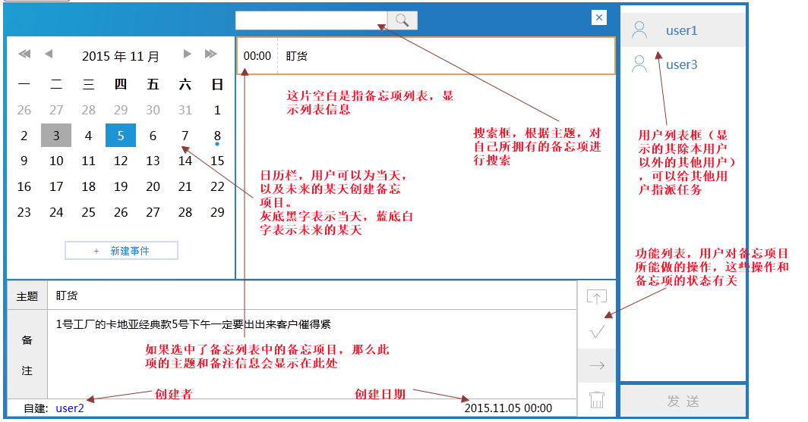
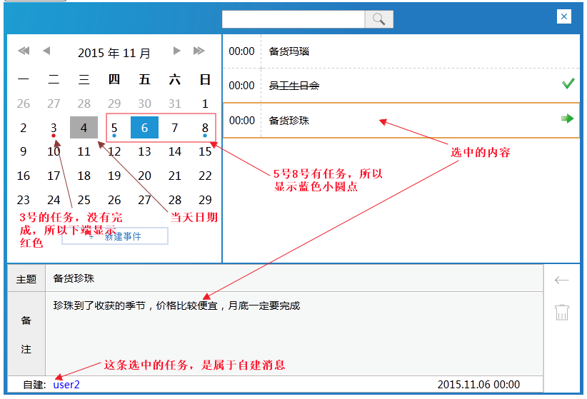
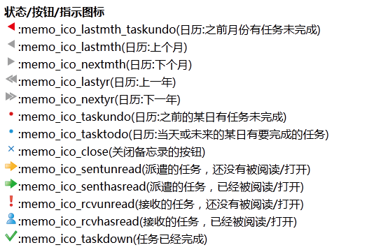
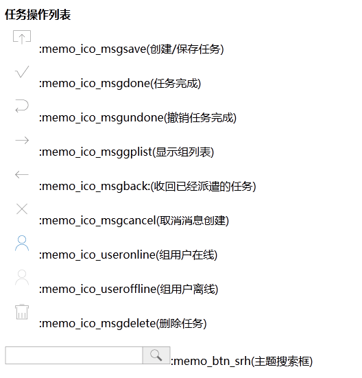
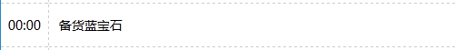
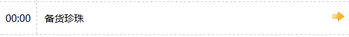
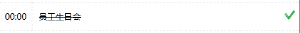
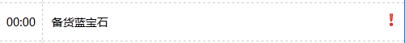

#备忘录控件
##简介
备忘录控件，用于公司管理人员内部通信。用于自己设定<b>当天</b>、或<b>未来</b>要完成的任务。也可用于上级向下级分配任务，以及查看下属是否已经完成自己所分配的任务等等
此控件是作为(Ajax)插件而完成的，通过简单的配置就可以嵌入到其他既成系统中

##可扩展部分
1. 实现组员实时上下线提示  
2. 监控员工的任务完成情况
3. 进一步限定任务的增删改查操作，使其更符合实际业务情况  
4. 进一步结合绩效考核系统，完成考核自动化  
5. 完善用户组，可以设施严格的"上级向下级"发送任务的功能 

##Bug部分
1. 点击操作时，没有提示，直接执行操作了
2. 信息入库以后，再次取回来，换行符没有了

##界面描述
###基本界面

###细节功能

###状态图标集合

###任务操作图标集合

##功能描述
###任务列表实时更新
不刷新页面显示其他同事派遣的任务

###管理员列表
<b>处理文件</b>：response/rspAdminList.php  
备忘录的用户列表，也是和其他系统整合的衔接处部分。  
<b>[扩展]</b>如果需要，此部分功能可以灵活地通过配置文件完成

###创建任务
<b>处理文件</b>:response/rspCreateList.php  
当选中日历中的日期方格(当天及以后)后，会出现'新建事件'按钮，点击此按钮以后，'主题'和'备注'二栏会开启，然后可以输入。
点击右侧的  按钮,可以取消创建项目。而点击  按钮，可以创建事件。当创建事件以后，相应日期方格下侧会出现一个小蓝点

###修改任务
<b>处理文件</b>:response/rspUpdateTask.php  
无论是自建任务，还是被人委派的任务，在未完成之前，都可以修改(备注部分)。
选中任务，点击右侧的功能按钮  如果任务没有做出修改，会提示'请先修改任务'。否则任务被成功修改

###删除任务
<b>处理文件</b>:response/rspDeleteTask.php  
任务的创建者，才有删除任务的权力，已经完成的信息，也可以删除。
选中任务，点击右侧的功能按钮  可以删除任务。删除任务后，如果任务早前被委任给另外一个人，那么此人也无法在任务列表信息中看到此信息了

###派遣任务
<b>处理文件</b>:response/rspDispatchTask.php  
选中任务，点击右侧的功能按钮  打开用户组列表，选中将要委任的同事，点击'发送'按钮，则可委任任务。任务派遣后，其状态标识为，如果对方已经'打开/阅读'过，那么其状态标识会变成

###撤销派遣任务
<b>处理文件</b>:response/rspUndispatchTask.php  
选中已经被派遣的任务，(即右侧有和图标),点击右侧  按钮。可以收回派遣的任务

###打开任务
<b>处理文件</b>:response/rspOpenTask.php  
打开任务操作，是针对于<b>被委任用户</b>的。当他们受到别人委托给自己的任务以后。如果没有打开过任务,其状态标识为，如果已经通过点击打开了此任务，那么任务状态变为

###任务完成
<b>处理文件</b>:response/rspTaskDone.php  
选中文件，点击右侧的 按钮，即可将任务标识为已完成。此时，任务状态标识为

###撤销任务完成
<b>处理文件</b>:response/rspTaskUndone.php  
选中文件，点击右侧的 按钮，即可将任务完成状态()撤销。
任务的状态标识恢复到以前的(如: )

###按主题查询任务
<b>处理文件</b>:response/rspSrhByCompleteInfo.php  
在备忘录的顶端的搜索框（）中，可以按主题查找任务(自建的或被委任的)

###日历单元格示警
<b>处理文件</b>:response/rspUnitDateTasks.php  
日历面板中，如果前一个月份还有没有完成的任务，那么切换月份的按钮会变成:，正常情况下是这样:
其他情况，看【界面描述>>基本界面|界面描述>>细节功能】

##任务的四种基本状态
1.(是否)已派遣(委任)  
2.(是否)已接收  
3.(是否)已阅读  
4.(是否)已完成 

##任务状态组合与对应的操作列表
<b>1.新建任务时</b>  
可执行的操作:保存|删除  

<b>2.任务已经创建后</b>  
可执行的操作: 修改 | 完成 | 派遣 | 删除  
任务状态:

<b>3.任务派遣后,对方未阅读</b>  
委任方,可执行的操作: 任务收回 | 删除  
任务状态:  

<b>4.任务派遣后,对方已阅读</b>  
委任方，可执行的操作: 任务收回 | 删除  
受任方，可执行的操作: 修改 |  完成
任务状态:  

<b>5.任务已完成</b>  
自建任务,可执行的操作: 撤销完成 | 删除   
委任任务,委任方可执行操作: 撤销完成  
委任任务,受任方可执行的操作: 删除
任务状态:  

<b>6.收到新任务,还未阅读/打开</b>  
任务状态:

<b>7.收到新任务,已经阅读/打开</b>  
可执行的操作: 修改 | 完成  
任务状态:

