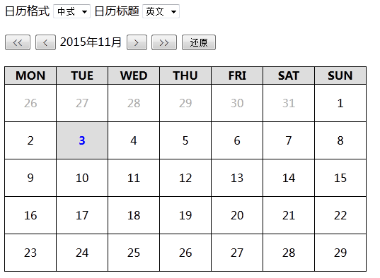
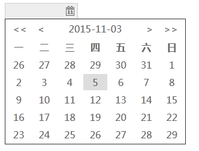
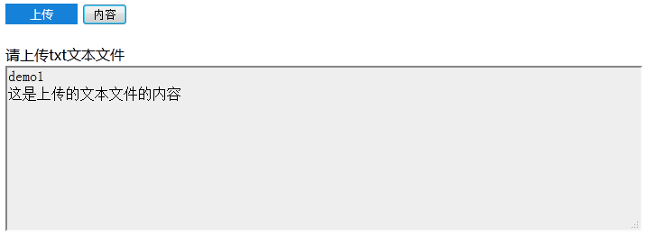
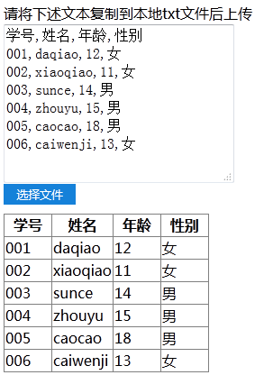
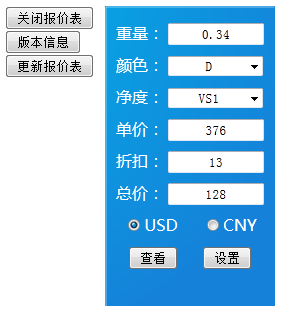
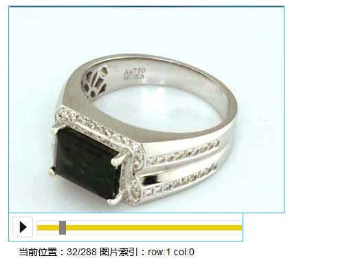

# myArts
一些小项目或者能够复用的小插件，具体功能请君往下一看
##Calener万年历
实现了一个js的日历库，万年历是对此库的应用
可以依赖此库做很多扩展的应用
###项目DEMO1

###演示地址
<a href="http://lucifer-v.net/Calender/" target="_blank">http://lucifer-v.net/Calender/</a>

##DatePicker日期拾取器控件
拾取日期，样式和显示方式可以自己设计与进一步完善
###项目DEMO1

###演示地址
<a href="http://lucifer-v.net/DatePicker/" target="_blank">http://lucifer-v.net/DatePicker/</a>

##FileContentReader
文件内容读取器控件
使用<b>Ajax</b>和后台脚本相结合，处理上传的文件内容，并将处理结果显示在页面中
###项目DEMO1
读取并显示上传的文本文件的内容  

###演示地址
<a href="http://lucifer-v.net/FileContentReader/demo.html" target="_blank">http://lucifer-v.net/FileContentReader/demo.html</a>

###项目DEMO2
读取一个CSV格式的文本文件，并以表格的形式显示出来  

###演示地址
<a href="http://lucifer-v.net/FileContentReader/example.html" target="_blank">http://lucifer-v.net/FileContentReader/example.html</a>
##Web版报价器(WebPR)
2014年将报价器实现为web版(并作为功能组件整合在SYSv2.x中)，并且开发了通过钻石的颜色、净度、重量来获取单价的接口。以供高层业务和其他终端app调用
###项目DEMO

###演示地址
<a href="http://lucifer-v.net/WebPR" target="_blank">http://lucifer-v.net/framePlayer</a>

##逐帧动画播放(360度旋转)
钻戒360旋转展示图
###项目DEMO

###演示地址
<a href="http://lucifer-v.net/framePlayer" target="_blank">http://lucifer-v.net/framePlayer</a>

##Android_priceReporter_1.x
2012年开发的小项目，根据钻石的重量(单位：克拉)、颜色和净度，显示钻石的单价、折扣和总价  
###项目DEMO
